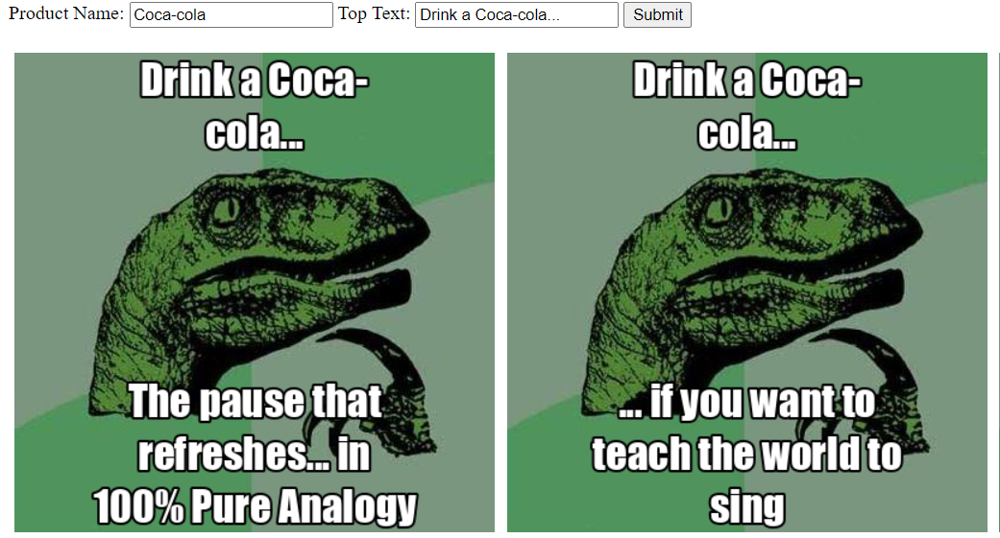
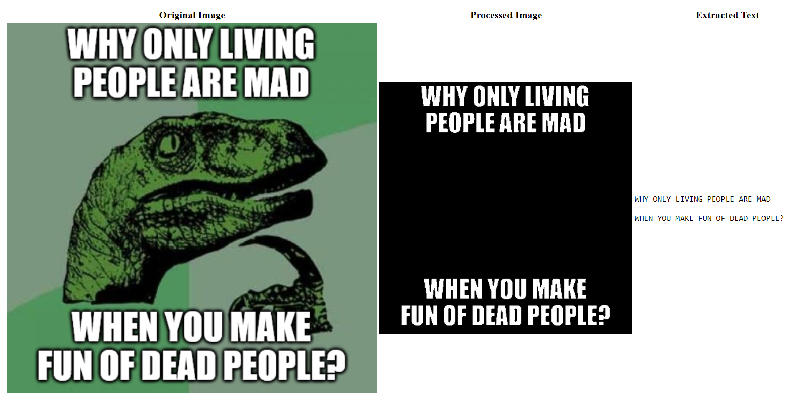
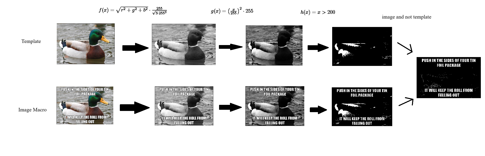

# Marketing Meme Generator



> Tired of paying interns to market your product? Do it yourself! This project parses an example dataset using an OCR model and uses the Cohere LLM to generate an image macro in the same format.

This project was developed from September 16-17 over 32 hours as part of [Hack the North 2023](https://devpost.com/software/marketing-meme-generator).

## What it does
An image macro is a form of internet meme where text is added onto specific images. While they are often used for humour, they can also be used for other purposes such as marketing.

This project allows the user to generate their own macros which promote a product. First, the user gives several example macros which originate from a template image. Then, the user inputs the product name and "top text" of the macro they want to generate. By using the examples together with the input data, an LLM can produce a new macro in a format similar to the examples that promotes the product.
## How we built it
There are two parts to this project:
### Extracting the text from examples

By performing several image processing manipulations on the example image with the aid of the template image, the text can be isolated enough for it to parsed by an OCR with great accuracy, regardless of resizing and JPEG artifacts.
1. The example is transformed into a grayscale image by taking the norm of the RGB vector and normalising it. Now, the white pixels are 255 and black pixels are 0.
2. The grayscale value of the pixels is squared and normalised again to increase the distance between white pixels and pixels which are close to being white.
3. The example is transformed into a black and white image by filtering out pixels whose values are below a certain threshold.
4. The above process is repeated with the template.
5. An new image is created by keeping the white pixels that are in the example, but not the template.

This algorithm works well because it keeps the pixels that were added to the template, by taking the difference between the example and template images. At the same time, it prevents interference from the black outline around the letters by keeping only the white pixels.

This algorithm works well with most examples, but cannot differentiate between pixels that are white because text was added, and pixels that were already white in the template. This can be mitigated by increasing the contrast between white and nearly-white pixels (hence step 2 in the algorithm), however, the algorithm still fails when the pixels in the template are the exact same colour as the text pixel (ex. if the template was a white square). One way to overcome this issue could be to take advantage of the black outline around the letters by using an edge detection filter.

The process of finding the image processing algorithm is documented in a [Kaggle notebook](https://www.kaggle.com/code/g1b3r1sh/extracting-text-from-image-macros).
### Generating the new macro with an LLM
Through reading articles and trial and error, several insights into generating pattern-based output were found:
- At the beginning of the prompt, state the purpose (ex. `Generate a viral image macro...`)
- Use adjectives to make small adjustments to the output and define any words which may cause confusion to the LLM (ex. `...a viral image macro advertising the product "[PRODUCT NAME]"`)
- Make sure the examples are clearly defined (ex. 
```
...in a similar format to the examples.

Top Text: [EXAMPLE TOP TEXT]
Bottom Text: [EXAMPLE BOTTOM TEXT]
...
```
)
- At the end, insert an incomplete example for the LLM to fill in (ex.
```
...[EXAMPLES]

Top Text: [USER INPUT]
Bottom Text:
```
)
- Ellipses can be used to encourage the LLM to complete a phrase from a previous line (ex.
```
...
Top Text: HAVE A [PRODUCT NAME]...
Bottom Text: 
```
)
## Challenges we ran into
In the end, most of the time was spent writing the image processing and LLM code, leaving little to no time to write a front-end. Over the course of 3 long hours, a barely-functioning front-end was cobbled together using Flask, asynchronous Javascript, and terrible HTML.

## What's next for Marketing Meme Generator
Maybe in the future, all internet content will be generated through processes like this :D
